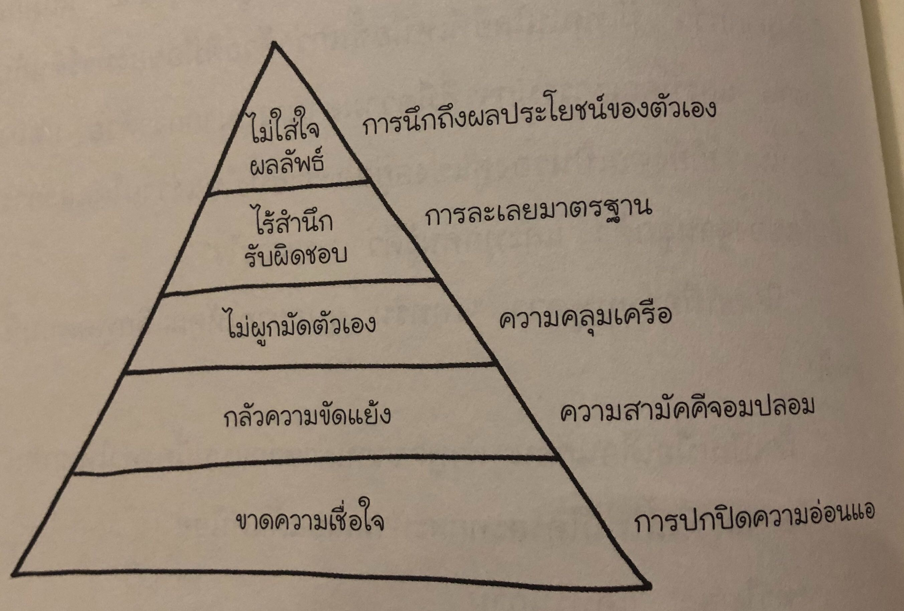

## จุดเริ่มต้น

บริษัทดีซิสชั่นเทคเคยรุ่งโรจน์มาก่อน ตอนนี้เริ่มเจอปัญหาอย่างต่อเนื่อง อย่างเช่น การทำงานไม่เสร็จตามกำหนด หรือพนักงานคนสำคัญลาออก บริษัทตัดสินใจที่จะปลด CEO ออกและประธานกรรมการได้ตัดสินใจจ้างแคทรินเข้ามาแทน โดยเชื่อว่าแคทรินมีพรสวรรค์ในการสร้างทีม ในขณะที่ผู้บริหารคนอื่นๆ ยังมีข้อสงสัยในตัวแคทรินอยู่ก็ตาม

ช่วงแรกๆ แคทรินเข้าไปสังเกตการณ์ในการประชุมต่างๆ พูดคุยกับพนักงาน ดูว่ามีปัญหาอะไรบ้างที่ดีซิสชั่นเทค แคทรินไม่ได้กังวลเรื่องที่เธอไม่ได้มีประสบการณ์เชิงลึกในเรื่องซอฟต์แวร์ เธอคิดว่ามันคือข้อได้เปรียบ เพราะผู้บริหารส่วนใหญ่ย่ำอยู่กับที่เพราะความมั่นใจในความรู้ของตัวเอง แคทรินรู้ว่าตัวเองไม่จำเป็นต้องเชี่ยวชาญในเรื่องนี้ แต่ก็รู้ว่าต้องเข้าใจเรื่องซอฟต์แวร์และเทคโนโลยีขององค์กรมากพอที่จะทำให้บริษัทผ่านวิกฤติไปได้

ถึงแม้ว่าผู้บริหารแต่ละคนจะเก่ง และฉลาดแค่ไหน แต่ว่าไม่ได้มีการทำงานร่วมกันเป็นทีมเลย การประชุมแต่ละครั้งแทบไม่มีการแลกเปลี่ยนความคิดเห็นกันอย่างจริงจัง ทุกคนดูเฝ้ารอว่าเมื่อไหร่การประชุมจะจบ ผู้บริหารส่วนใหญ่มีเจตนาที่ดี จะมีข้อยกเว้นแค่บางคน แคทรินก็ได้ทำความรู้จักกับผู้บริหารแต่ละคน มองลักษณะบุคลิก นิสัยใจคอ และดูว่าแต่ละคนก็จะมีข้อดีข้อเสียอะไรบ้าง

ทีมที่แตกคอกันไม่ต่างอะไรกับคนที่แขนขาหัก การรักษาย่อมมาพร้อมกับความเจ็บปวดเสมอ บางครั้งเราก็จำเป็นต้องหักมันอีกรอบถึงจะทำให้การรักษาสมบูรณ์ ซึ่งความเจ็บปวดย่อมต้องมากกว่าครั้งแรกเสมอ

## พีระมิดจุดบอด 5 ประการที่ทำให้ทีมย่ำแย่

1. **ขาดความเชื่อใจ (การปกปิดความอ่อนแอ)** - ให้เอาชนะความต้องการที่จะปกปิดความอ่อนแอของตัวเอง ถ้าเราไม่เปิดเผยข้อผิดพลาดและจุดอ่อนออกมาจะไม่สามารถสร้างความเชื่อใจได้
1. **กลัวความขัดแย้ง (ความสามัคคีจอมปลอม)** - การเก็บงำความคิดเห็นความกังวลเอาไว้กับตัวไม่ใช่เรื่องที่ดี ให้ถกเถียงกันอย่างสร้างสรรค์แล้วแยกย้ายโดยไม่มีอะไรติดค้างในใจ ทีมที่ไม่เชื่อใจกันจะไม่สามารถถกเถียงเกี่ยวกับแนวคิดได้อย่างเต็มที่ การประชุมที่ีน่าเบื่ออาจจะเป็นเพราะไม่มีความขัดแย้งที่สร้างสรรค์ และอาจจะขาดความขัดแย้งที่ควรค่าแก่การนำมาถกเถียง เมื่อเริ่มรู้สึกอึดอัดกับความขัดแย้ง ให้ช่วยกันเตือนว่านี่คือสิ่งจำเป็นที่จะส่งผลดีต่อทีม
1. **ไม่ผูกมัดตัวเอง (ความคลุมเครือ)** - ถ้าคนเราไม่ได้แสดงความคิดเห็น ไม่รู้สึกว่าคนอื่นรับฟังสิ่งที่ตัวเองพูด พวกเขาก็จะไม่รู้สึกว่าตัวเองเป็นส่วนหนึ่งของทีม เมื่อไม่ได้แสดงความคิดเห็นออกมา สมาชิกในทีมก็จะไม่ยอมรับและไม่ยึดมั่นในการตัดสินใจ แม้ว่าเขาจะแสดงท่าทีเห็นด้วยก็ตาม
1. **ไร้สำนึกรับผิดชอบ (การละเลยมาตรฐาน)** - เมื่อเราเข้าใจและยอมรับการตัดสินใจของทีมแล้ว เราต้องช่วยกันรับผิดชอบต่อสิ่งที่ตกลงจะทำร่วมกัน คนเราไม่มีทางแสดงความรับผิดชอบร่วมกันได้ ถ้าความเห็นไม่ตรงกัน ช่วยกันรักษามาตรฐานของผลงานและพฤติกรรมให้สูงเข้าไว้ โดยเฉพาะเวลาที่เพื่อนร่วมงานทำตัวไม่ดี ต้องท้วงติงเสมอ สมาชิกในทีมต้องมีความตั้งใจที่จะบอกให้เพื่อนร่วมทีมรู้ว่าผลงานหรือพฤติกรรมของเขาอาจส่งผลเสียต่อทีม
1. **ไม่ใส่ใจผลลัพธ์ (การนึกถึงผลประโยชน์ของตัวเอง)** - ถ้าทุกคนนึกถึงผลลัพธ์ของทีมและมองว่าเป็นตัวกำหนดความสำเร็จ ทุกคนจะรู้ดีกว่าไม่ว่าตัวเองจะดูดีแค่ไหน ถ้าทีมแพ้ ทุกคนก็แพ้ด้วย ถ้ามองในระดับบริษัท ถ้าบริษัทแย่ ไม่ว่าทีมของเราจะทำได้ดีแค่ไหนก็ฟังไม่ขึ้นหรอก

การทำงานเป็นทีมจะเกิดขึ้นได้ยากถึงแม้ทีมจะมีจุดบอดเพียงประการเดียว เพราะแต่ละจุดบอดเป็นบ่อเกิดของอีกจุดบอดหนึ่ง

ถ้าเรามองพีระมิดแบบตรงข้าม เราจะเห็นทีมที่มีความกลมเกลียวกัน ซึ่งจะมีพฤติกรรมดังนี้

1. เชื่อใจกัน
1. เข้าร่วมในความขัดแย้งอย่างเต็มที่
1. ยึดมั่นในการตัดสินใจและแผนการของทีม
1. รับผิดชอบร่วมกันในการทำให้คนในทีมทำตามแผนที่วางไว้
1. พุ่งเป้าไปที่การบรรลุเป้าหมายของทีม
